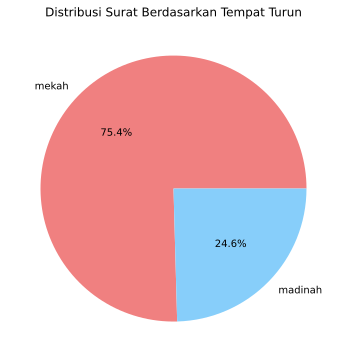
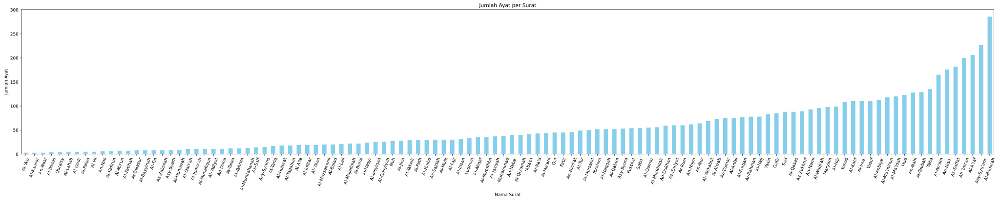
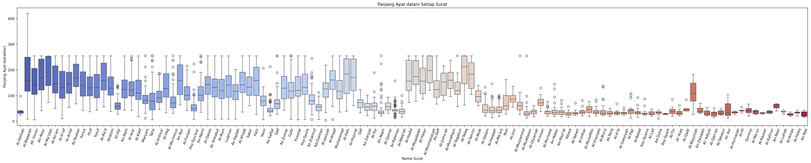

## Sample data

### This dataset was taken using scraping from [quran.kemenag.go.id](https://quran.kemenag.go.id/).

| id_surat | no_surat | nama_surat | nama_surat_arab | arti_surat | ayat | surat | latin | terjemahan | tempat_turun | deskripsi |
| :---------- | :----------: | :--------------: | :----------------------: | :-----------: | :----: | :-----: | :----: | :-------------: |  :----------------: | -----------: |
| 1 | 1 | Al-Fatihah | الفاتحة | Pembukaan | 1 | بِسْمِ اللّٰهِ الرَّحْمٰنِ الرَّحِيْمِ | bismi laahi rrahmaani rrahiim | "Dengan nama Allah Yang Maha Pengasih, Maha Penyayang." |  mekah | "Surat Al Faatihah (Pembukaan) yang diturunkan di Mekah...." |
| 2 | 1 | Al-Fatihah | الفاتحة | Pembukaan | 2 | اَلْحَمْدُ لِلّٰهِ رَبِّ الْعٰلَمِيْنَ  | alhamdu lillaahi rabbi l'aalamiin | "Segala puji bagi Allah, Tuhan seluruh alam," |  mekah | "Surat Al Faatihah (Pembukaan) yang diturunkan di Mekah...." |
| 3 | 1 | Al-Fatihah | الفاتحة | Pembukaan | 2 | الرَّحْمٰنِ الرَّحِيْمِۙ | arrahmaani rrahiim | "Yang Maha Pengasih, Maha Penyayang," |  mekah | "Surat Al Faatihah (Pembukaan) yang diturunkan di Mekah...." |
| ...    | ...             | ...                 | ...      | ...          | ...         | ...            | ...              | ...         | ...              | ...              |
| 6236 | 114 | An-Nas | الناس | Manusia | 6 | مِنَ الْجِنَّةِ وَالنَّاسِ | mina ljinnati wannaas | "dari (golongan) jin dan manusia." |  mekah | "Surat ini terdiri atas 6 ayat ..." |

### Recap Information

